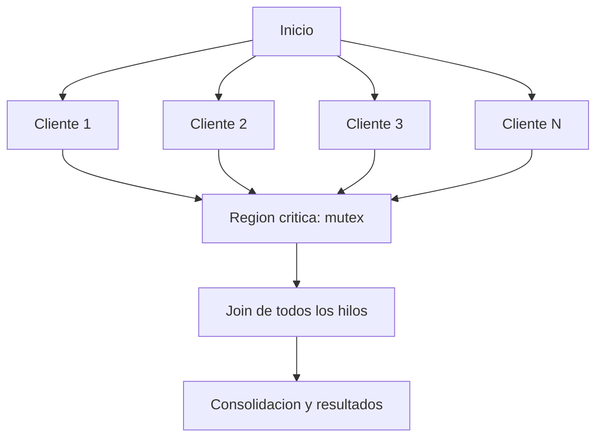

# Bosquejo y Guion del Video

**Tema:** Sincronizacion de hilos en C++ (`lock`, `unlock`, `detach`, `lock_guard`, `unique_lock`) aplicado a la asignacion de asientos de un cine.
**Duracion objetivo:** 16-18 minutos.
**Integrantes:** 4 personas (bloques I - IV).
**Formato:** cada integrante aparece en camara y explica su parte; se intercalan capturas de codigo y diagramas.

---

## 1. Bosquejo general (estructura / storyboard)

| # | Bloque | Contenido | Responsable | Duracion | Recurso visual |
|---|--------|-----------|-------------|----------|----------------|
| 1 | Intro | Problema de la concurrencia: condicion de carrera. Que es un hilo. | Persona 1 | 2:30 | Portada + ejemplo de dos taquillas vendiendo el mismo asiento |
| 2 | Herramientas base | `std::thread`, `join`, `detach`, cabecera `<thread>`, estados de un hilo. | Persona 1 | 3:30 | Codigo minimo + linea de tiempo de hilos |
| 3 | Exclusion mutua | `std::mutex`, `lock()`, `unlock()`, `try_lock()`, region critica. Cabecera `<mutex>`. | Persona 2 | 3:30 | Cine con puerta: solo entra un hilo a la vez |
| 4 | RAII | `lock_guard`, `unique_lock`, `scoped_lock`, `defer_lock`, `try_to_lock`. | Persona 3 | 3:00 | Tabla comparativa + codigo |
| 5 | Problema del cine | Reglas, estructuras, grafo de precedencia y bloques COBEGIN-COEND. | Persona 4 | 2:30 | Pizarra: grafo + COBEGIN-COEND |
| 6 | Codigo y demo | Recorrido del codigo enfocando `mutex`/`lock`; ejecucion en vivo. | Persona 4 | 3:00 | IDE + terminal ejecutando `cine` |
| 7 | Cierre | Conclusiones, buenas practicas (evitar `detach` sin control). | Persona 1 | 1:00 | Resumen |

**Materiales:** 2 camaras o 1 camara + grabacion de pantalla, pizarra/tablero, proyector y el proyecto `programa/` (archivos `persona.h/.cpp`, `asiento.h/.cpp`, `sala.h/.cpp`, `main.cpp`), compilado con `g++ -std=c++17 -pthread -I . main.cpp sala.cpp asiento.cpp persona.cpp -o cine`.

---

## 2. Reparto de responsabilidades

- **Persona 1 - "Fundamentos y cierre":** contextos de concurrencia, `std::thread`, `join`/`detach`, cabeceras, resumen final.
- **Persona 2 - "Mutex crudo":** `std::mutex`, `lock`, `unlock`, `try_lock`, region critica, `recursive_mutex`.
- **Persona 3 - "RAII":** `lock_guard`, `unique_lock`, `scoped_lock`, politicas `defer_lock`/`try_to_lock`/`adopt_lock`, `std::lock` anti-deadlock.
- **Persona 4 - "Aplicacion":** enunciado del cine, grafo de precedencia, COBEGIN-COEND, codigo y demostracion.

---

## 3. Guion detallado

### BLOQUE I - Persona 1 (2:30) Fundamentos

**[En camara, portada con el titulo]**
> "Hola, somos el equipo y en este video explicamos como sincronizar hilos en C++ con `lock`, `unlock`, `detach`, `lock_guard` y `unique_lock`, y lo aplicaremos al control de asientos de un cine de 8 por 10."

**[Grabacion de pantalla: dos terminales vendiendo el asiento (0,0)]**
> "Imaginen dos taquillas: ambas consultan el asiento 0,0, lo ven libre y las dos lo venden. Eso es una **condicion de carrera**. Ocurre porque varios **hilos** acceden al mismo recurso compartido sin coordinarse."

**[Dioptima "hilo = flujo de ejecucion dentro del proceso"]**
> "Un hilo es un flujo de ejecucion dentro del proceso. Todos comparten memoria; por eso necesitan reglas de acceso."

**[Codigo minimo en pantalla]**
```cpp
#include <thread>   // std::thread
#include <iostream>

void tarea() { std::cout << "Hola desde un hilo\n"; }

int main() {
    std::thread hilo(tarea);   // crea el hilo
    hilo.join();               // espera a que termine
    return 0;
}
```
> "La cabecera `<thread>` nos da `std::thread`. Tenemos dos formas de esperarlo:
> - `join()`: el hilo principal espera a que termine. **Es la opcion segura.**
> - `detach()`: separa el hilo y sigue de largo; el hilo corre en segundo plano por su cuenta. **Peligroso**: si el `main` termina antes, el programa puede fallar."

> "Regla practica: usa `join()` casi siempre; reserva `detach()` para tareas de fondo que no tocan datos que puedan desaparecer."

---

### BLOQUE II - Persona 2 (3:30) Mutex, lock y unlock

**[En camara]**
> "Para evitar la condicion de carrera usamos un **mutex** (exclusion mutua). La cabecera es `<mutex>`. Es como la puerta del bano: solo un hilo entra a la vez."

**[Dioptima: sintaxis cruda]**
```cpp
#include <mutex>
std::mutex mtx;          // recurso compartido: la puerta

mtx.lock();              // intenta entrar (si esta ocupado, ESPERA)
// ---- region critica: leer/modificar el recurso compartido ----
// asientos[fila][col] = ocupado;
mtx.unlock();            // sale y deja entrar al siguiente
```

- `lock()`: adquiere el mutex; si otro hilo lo tiene, se **bloquea** hasta que se libere.
- `unlock()`: libera el mutex. **Debe llamarse siempre**, incluso ante excepciones.
- `try_lock()`: intenta sin esperar; devuelve `true` si lo obtuvo, `false` si esta ocupado.

```cpp
if (mtx.try_lock()) {          // no bloquea
    // ... region critica ...
    mtx.unlock();
} else {
    // el recurso estaba ocupado; hago otra cosa
}
```

**[En camara]**
> "El error tipico es olvidar el `unlock()` o salir antes por un `return` o una excepcion. Eso deja la puerta cerrada para siempre (**deadlock**). Por eso casi nunca usamos `lock`/`unlock` a mano, sino envoltorios RAII."
>
> "Existen otras variantes: `std::recursive_mutex` permite que el mismo hilo lo bloquee varias veces; `std::timed_mutex` agrega `try_lock_for` y `try_lock_until`."

---

### BLOQUE III - Persona 3 (3:00) lock_guard, unique_lock y compania

**[En camara]**
> "RAII significa que un objeto adquiere el recurso al construirse y lo libera al destruirse. Asi el `unlock()` es automatico y no se nos puede olvidar."

**[Dioptima comparativa]**

| Herramienta | Cabecera | Bloquea al crear | Se libera | Cuando usarlo |
|---|---|---|---|---|
| `std::lock_guard` | `<mutex>` | Si | Al salir del `{ }` | Caso simple y rapido |
| `std::unique_lock` | `<mutex>` | Configurable | Al salir del `{ }` | Necesitas flexibilidad |
| `std::scoped_lock` | `<mutex>` (C++17) | Si (varios) | Al salir | Varios mutex a la vez |

**[Codigo]**
```cpp
#include <mutex>

bool Sala::asignarAsiento(int fila, int columna, const Persona& persona) {
    std::lock_guard<std::mutex> lock(mtx);   // lock() automatico
    if (!dentroDeRango(fila, columna)) return false;   // unlock() se hace solo
    return asientos[fila][columna].ocupar(persona);
}                                            // <-- destructor: unlock()
```

```cpp
#include <mutex>

// unique_lock permite diferir el bloqueo y decidir despues
std::unique_lock<std::mutex> lock(mtx, std::defer_lock);
// ... trabajo sin lock ...
lock.lock();                 // ahora si bloqueo
// ... region critica ...
lock.unlock();               // puedo soltarlo manualmente
// ... y volver a tomarlo si hace falta
```

> "`unique_lock` es movible (se puede devolver desde una funcion) y admite estrategias:
> - `std::defer_lock`: **no** bloquea al construir, lo haces luego.
> - `std::try_to_lock`: intenta sin esperar; revisamos `lock.owns_lock()`.
> - `std::adopt_lock`: asume que el mutex **ya** fue bloqueado.
> - `std::scoped_lock` o `std::lock(lockA, lockB)`: toman **varios** mutex a la vez aplicando un algoritmo que evita el interbloqueo."

```cpp
std::scoped_lock lock(mtxA, mtxB);   // 2 mutex, sin deadlock
```

**[En camara]**
> "Regla: protege con el mismo mutex **todas** las lecturas y escrituras del recurso compartido. Si solo proteges las escrituras, la carrera sigue."

---

### BLOQUE IV - Persona 4 (5:30) Problema del cine

**[En camara, pizarra]**
> "Apliquemos todo. **Enunciado:** una sala de 8 x 10. Al asignar un asiento registramos nombre y edad. El usuario elige un asiento solo si esta libre. Ademas podemos liberar, buscar por nombre o por asiento, y mostrar la sala."

**[Dioptima: estructuras del programa]**

> "Separamos responsabilidades. `Persona` es el ocupante; `Asiento` guarda su estado; `Sala` es la duena de la coleccion y por eso es la duena del mutex."

```cpp
// persona.h  -> el ocupante (nombre y edad, con validacion)
class Persona {
    std::string nombre;
    int edad;
public:
    Persona(std::string nombre, int edad);
    const std::string& getNombre() const;
    int getEdad() const;
};

// asiento.h -> estado de un asiento. La presencia del optional ES el "ocupado"
class Asiento {
    int numero;
    std::optional<Persona> ocupante;
public:
    explicit Asiento(int numero);
    bool isOcupado() const;
    bool ocupar(const Persona& persona);   // false si ya habia ocupante
    bool liberar();                        // false si ya estaba libre
    bool perteneceA(const std::string& nombre) const;
    std::optional<Persona> getOcupante() const;
};

// sala.h -> RECURSO COMPARTIDO + el mutex que lo protege
class Sala {
    int filas, columnas;
    std::vector<std::vector<Asiento>> asientos;
    mutable std::mutex mtx;
public:
    Sala(int filas, int columnas);
    bool asignarAsiento(int fila, int columna, const Persona& persona);
    bool liberarAsiento(int fila, int columna);
    std::optional<Persona> buscarPorAsiento(int fila, int columna) const;
    std::vector<std::pair<int,int>> buscarPorNombre(const std::string& nombre) const;
    int asientosOcupados() const;
    void mostrarSala() const;
};
```

> "Fijense: el `Asiento` **no** tiene mutex ni lee del teclado. Sabe ocuparse y liberarse respetando su invariante (nunca dos ocupantes). La sincronizacion queda toda en `Sala`."

#### 3.1 Grafo de precedencia

> "El grafo muestra que los clientes (tareas paralelas) deben pasar **uno a uno** por la region critica antes de poder consolidar resultados."

```
                         +----------------------+
                         |  Inicio (inicializar |
                         |  la sala y el mutex) |
                         +----------+-----------+
                                    |
             +----------------------+----------------------+
             |            |              |                  |
             v            v              v                  v
        +---------+  +---------+   +---------+        +---------+
        | Cliente |  | Cliente |   | Cliente |  ...   | Cliente |
        |   1     |  |   2     |   |   3     |        |   N     |
        +----+----+  +----+----+   +----+----+        +----+----+
             \           |             |                  /
              \          |             |                 /
               v         v             v                v
          +-----------------------------------------------+
          |        REGION CRITICA  (mutex mtx)            |
          |   lock() -> leer/escribir asientos -> unlock()|
          +-----------------------+-----------------------+
                                  |
             +--------------------+-------------------+
             |          |             |                |
             v          v             v                v
          join(1)    join(2)       join(3)  ...     join(N)
             \          |             |                /
              +---------+-------------+---------------+
                                  |
                                  v
                       +-----------------------+
                       |  Consolidacion final  |
                       |  mostrar / buscar     |
                       +-----------------------+
```

**Version Mermaid (opcional, si se proyecta en un editor compatible):**


> "Las flechas son **precedencias**: el mutex `A -> RC` obliga a serializar; y `RC -> J` indica que la consolidacion solo ocurre cuando los hilos terminaron (`join`)."

#### 3.2 Bloques COBEGIN-COEND

> "La notacion COBEGIN-COEND expresa el paralelismo: todo lo que esta entre ellos se ejecuta en paralelo."

```
Sala sala(8, 10);            // inicializacion secuencial (fuera del COBEGIN)

COBEGIN
    P1 : sala.asignarAsiento(0, 0, Persona("Ana",   20));   // compiten por (0,0)
    P2 : sala.asignarAsiento(0, 0, Persona("Luis",  23));   // compiten por (0,0)
    P3 : sala.asignarAsiento(0, 0, Persona("Maria", 22));   // compiten por (0,0)
    P4 : sala.asignarAsiento(2, 4, Persona("Pedro", 21));
    P5 : sala.asignarAsiento(3, 7, Persona("Sofia", 19));
COEND

liberarAsiento(2, 4);        // fase secuencial posterior
buscarPorAsiento(0, 0);
buscarPorNombre("Sofia");
mostrarSala();
```

> "Cada `asignarAsiento` internamente abre la region critica con `lock_guard<std::mutex> lock(mtx)`. No hace falta escribir `lock`/`unlock` a mano: el destructor del guard los balancea."

> "Noten que los tres primeros intentan el **mismo** asiento (0,0). Gracias al mutex, solo uno gana; los demas reciben 'no disponible'. **Eso es la exclusion mutua funcionando.**"

#### 3.3 Codigo clave comentado (el del programa real)

```cpp
// ---- sala.cpp : TODA operacion abre su region critica con lock_guard ----

bool Sala::asignarAsiento(int fila, int columna, const Persona& persona) {
    std::lock_guard<std::mutex> lock(mtx);          // <-- LOCK
    if (!dentroDeRango(fila, columna)) return false;
    return asientos[fila][columna].ocupar(persona); // false si ya ocupado
}                                                    // <-- UNLOCK automatico

bool Sala::liberarAsiento(int fila, int columna) {
    std::lock_guard<std::mutex> lock(mtx);
    if (!dentroDeRango(fila, columna)) return false;
    return asientos[fila][columna].liberar();
}

std::optional<Persona> Sala::buscarPorAsiento(int fila, int columna) const {
    std::lock_guard<std::mutex> lock(mtx);          // tambien protege lecturas
    if (!dentroDeRango(fila, columna)) return std::nullopt;
    return asientos[fila][columna].getOcupante();
}

std::vector<std::pair<int, int>>
Sala::buscarPorNombre(const std::string& nombre) const {
    std::lock_guard<std::mutex> lock(mtx);
    std::vector<std::pair<int, int>> encontrados;
    for (int f = 0; f < filas; ++f)
        for (int c = 0; c < columnas; ++c)
            if (asientos[f][c].perteneceA(nombre))
                encontrados.emplace_back(f, c);
    return encontrados;
}
```

```cpp
// ---- asiento.cpp : invariantes (aqui NO hay mutex) ----

bool Asiento::ocupar(const Persona& persona) {
    if (ocupante.has_value()) return false;   // ya ocupado -> rechaza
    ocupante = persona;
    return true;
}

bool Asiento::liberar() {
    if (!ocupante.has_value()) return false;  // ya libre -> rechaza
    ocupante.reset();
    return true;
}
```

```cpp
// ---- main.cpp : creacion de hilos (COBEGIN) y join (COEND) ----

void reservar(Sala& sala, int fila, int columna,
              const std::string& nombre, int edad) {
    Persona persona(nombre, edad);
    bool ok = sala.asignarAsiento(fila, columna, persona);
    std::cout << (ok ? "[OK] " : "[X]  ") << nombre
              << " -> asiento (" << fila << "," << columna << ")"
              << (ok ? " reservado\n" : " no disponible\n");
}

int main() {
    Sala sala(8, 10);
    std::vector<std::thread> hilos;
    hilos.emplace_back(reservar, std::ref(sala), 0, 0, "Ana",   20);
    hilos.emplace_back(reservar, std::ref(sala), 0, 0, "Luis",  23);
    hilos.emplace_back(reservar, std::ref(sala), 0, 0, "Maria", 22);
    hilos.emplace_back(reservar, std::ref(sala), 2, 4, "Pedro", 21);
    hilos.emplace_back(reservar, std::ref(sala), 3, 7, "Sofia", 19);
    for (auto& hilo : hilos) hilo.join();   // COEND
    // ... liberar, buscar por asiento/nombre y mostrarSala()
}
```

> "Nota: `unique_lock`, `scoped_lock` y `detach` se explican en la teoria (bloques II y III); en este programa concreto basta `lock_guard` dentro de cada metodo de `Sala` y `join()` en `main`. Son extensiones para quien quiera bloqueo diferido, varios mutex o un hilo de fondo."

**[Demo en vivo: `./cine`]**
> "Ejecutamos. Observen: **Ana** gana el (0,0); Luis y Maria reciben 'no disponible'. Luego liberamos (2,4), buscamos por asiento (0,0) que devuelve a Ana, buscamos a 'Sofia' que aparece en (3,7), y mostramos la sala con 2 de 80 asientos ocupados."

---

### BLOQUE V - Persona 1 (1:00) Cierre

**[En camara, equipo completo]**
> "Recapitulando:
> 1. Los hilos comparten memoria: hay que sincronizarlos.
> 2. `<thread>` da `std::thread`; `join` espera, `detach` separa (usar con cuidado).
> 3. `<mutex>` da `std::mutex` con `lock`/`unlock`/`try_lock`.
> 4. `lock_guard`, `unique_lock` y `scoped_lock` liberan solos (RAII).
> 5. Protegemos el recurso compartido: los asientos del cine.
>
> Gracias por vernos."

---

## 4. Tabla de funciones y cabeceras (apoyo para cualquier integrante)

| Funcion / clase | Cabecera | Que hace |
|---|---|---|
| `std::thread` | `<thread>` | Crea un hilo de ejecucion |
| `.join()` | `<thread>` | Espera a que el hilo termine |
| `.detach()` | `<thread>` | Separa el hilo (corre solo) |
| `.joinable()` | `<thread>` | `true` si se puede hacer join/detach |
| `std::mutex` | `<mutex>` | Exclusion mutua basica |
| `.lock()` / `.unlock()` | `<mutex>` | Bloquea / libera el recurso |
| `.try_lock()` | `<mutex>` | Intenta sin esperar (`bool`) |
| `std::recursive_mutex` | `<mutex>` | Re-bloqueo por el mismo hilo |
| `std::timed_mutex` | `<mutex>` | `try_lock_for` / `try_lock_until` |
| `std::lock_guard` | `<mutex>` | RAII simple |
| `std::unique_lock` | `<mutex>` | RAII flexible, movible |
| `std::scoped_lock` | `<mutex>` | RAII para varios mutex (C++17) |
| `std::lock(a,b)` | `<mutex>` | Bloquea varios sin deadlock |
| `std::defer_lock` | `<mutex>` | No bloquear al construir |
| `std::try_to_lock` | `<mutex>` | Intentar sin esperar |
| `std::adopt_lock` | `<mutex>` | Asumir mutex ya bloqueado |
| `std::condition_variable` | `<condition_variable>` | Esperar a que se cumpla algo |
| `std::atomic<T>` | `<atomic>` | Operaciones sin mutex (banderas) |

**Compilacion del programa real:**
```bash
g++ -std=c++17 -Wall -Wextra -pthread -I . main.cpp sala.cpp asiento.cpp persona.cpp -o cine
./cine
```

---

## 5. Checklist de grabacion

- [ ] Presentar a los 4 integrantes por nombre.
- [ ] Cada persona en camara al menos una vez.
- [ ] Mostrar la condicion de carrera ANTES y el resultado DESPUES.
- [ ] Mostrar el grafo de precedencia y los bloques COBEGIN-COEND en pizarra.
- [ ] Enfatizar en pantalla `lock`, `unlock`, `lock_guard`, `unique_lock`.
- [ ] Ejecutar el programa: mostrar dos clientes compitiendo por el mismo asiento.
- [ ] Cerrar con las buenas practicas (preferir RAII, evitar `detach` sin control).
